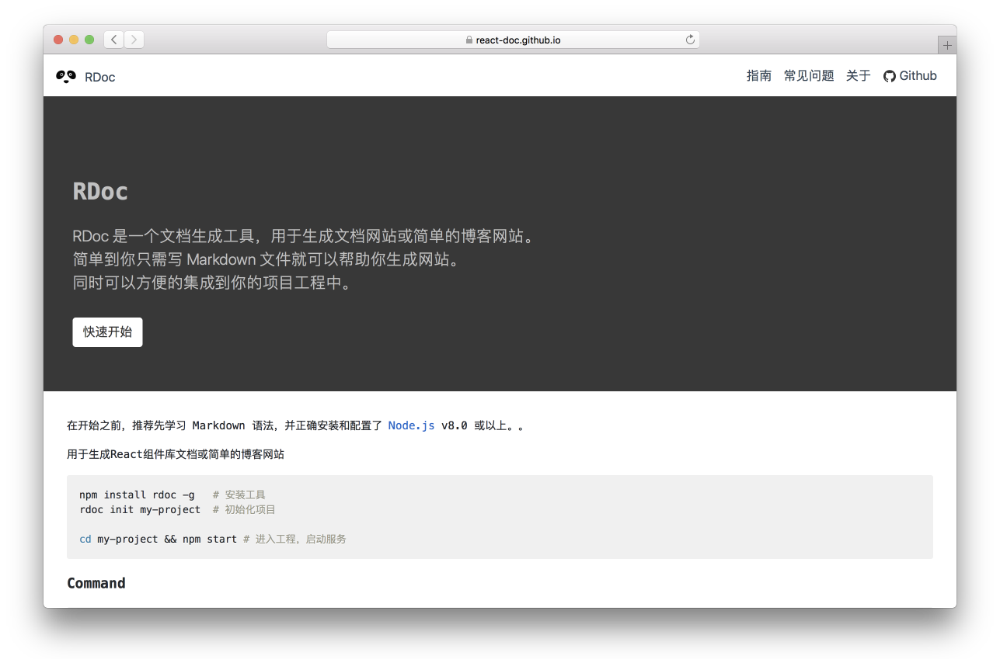

<p align="center">
  <a href="https://react-doc.github.io">
    
  </a>
</p>

rdoc
---

[](https://gitter.im/j-rdoc/Lobby?utm_source=badge&utm_medium=badge&utm_campaign=pr-badge&utm_content=badge)

Blazing-fast static site generator for React, Just write Markdown file. Visit the [react-doc.github.io](https://react-doc.github.io) website for more information.

<div align="center">
   
</div>

## Getting Started

It's really easy to get started with **rdoc**. Just install it as a module and run it to create your website.

Let's get you started!

### Install

Install `rdoc` globally on your system. You’ll need to have Node >= 8 on your local development machine. You can use [n](https://github.com/tj/n#installation) to easily switch Node versions between different projects.

```bash
npm install rdoc -g

# /usr/local/bin/rdoc -> /usr/local/lib/node_modules/rdoc/.bin/rdoc.js
# /usr/local/bin/rdoc-cli -> /usr/local/lib/node_modules/rdoc/.bin/rdoc.js
```

Added `rdoc-cli` command to resolve Mac integration `rdoc` command conflicts.

1. Init Project

```bash
rdoc init my-project  # Init project
# or
rdoc-cli init my-project 
```

2. Run website

```bash
cd my-project && npm install # Install dependencies.
npm start # Into the directory, start the service.
```

3. Compile output static HTML resources

```bash
npm run build
```

4. Configure the deployment URL in `package.json`

```js
{
  "scripts": {
    "deploy": "rdoc --publish <your repo url>"
    ...
  },
  ...
}
```

5. Deploy to Github's `gh-pages` branch

```bash
npm run deploy
```

### Command

```shell
Usage: rdoc [options]

Fast static site generator for React.

Options:

  -i, init [path]        Create an empty website or reinitialize an existing one.
  -d, --doc <path>       Other documents generated.
  -o, --output <path>    Writes the compiled file to the disk directory. (default: .rdoc-dist)
  -p, --port [number]    The port. (default: 5858)
  -h, --host [host]      The host. (default: 0.0.0.0)
  -b, --branch <branch>  Name of the branch you are pushing to. (default: gh-pages)
  --publish [url]        Other documents generated.
  --build                Creating an optimized production build.
  --clean                Delete the .cache folder.
  -h, --help             output usage information

Examples:

  $ rdoc init
  $ rdoc init doc-example
  $ rdoc -d doc/mm
  $ rdoc -d tutorial,doc
  $ rdoc -d tutorial,doc --clean --build
  $ rdoc -p 2323  -d doc --clean
  $ rdoc -h 0.0.0.0 -d doc --clean
  $ rdoc --publish https://<your-git-repo>.git --branch master
```
### Development

To develop, run the self-reloading build, Get the code:

```shell
$ git clone https://github.com/jaywcjlove/rdoc.git
$ cd rdoc     # Into the directory
$ npm install # or  yarn install
```

To develop, run the self-reloading build:

```bash
# Run the app
# Restart the app automatically every time code changes. 
# Useful during development.
$ npm run start
```

Open your browser and visit http://localhost:5858

### Folders

```bash
.
├── README.md
├── .rdoc-dist
├── package.json
├── src
│   ├── build.js
│   ├── commands
│   ├── conf
│   ├── publish.js
│   ├── server.js
│   ├── utils
│   └── web
├── templates
│   └── default # document the static file.
└── theme
    └── default
```

### License

The MIT License (MIT)
